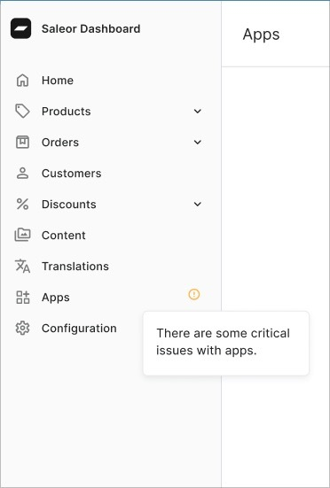

Benefit from new notifications in your Dashboard that alert you to issues with webhooks for your apps, helping you stay informed about potential problems.
We’re continuously working to expand this feature to provide more insights for your apps.