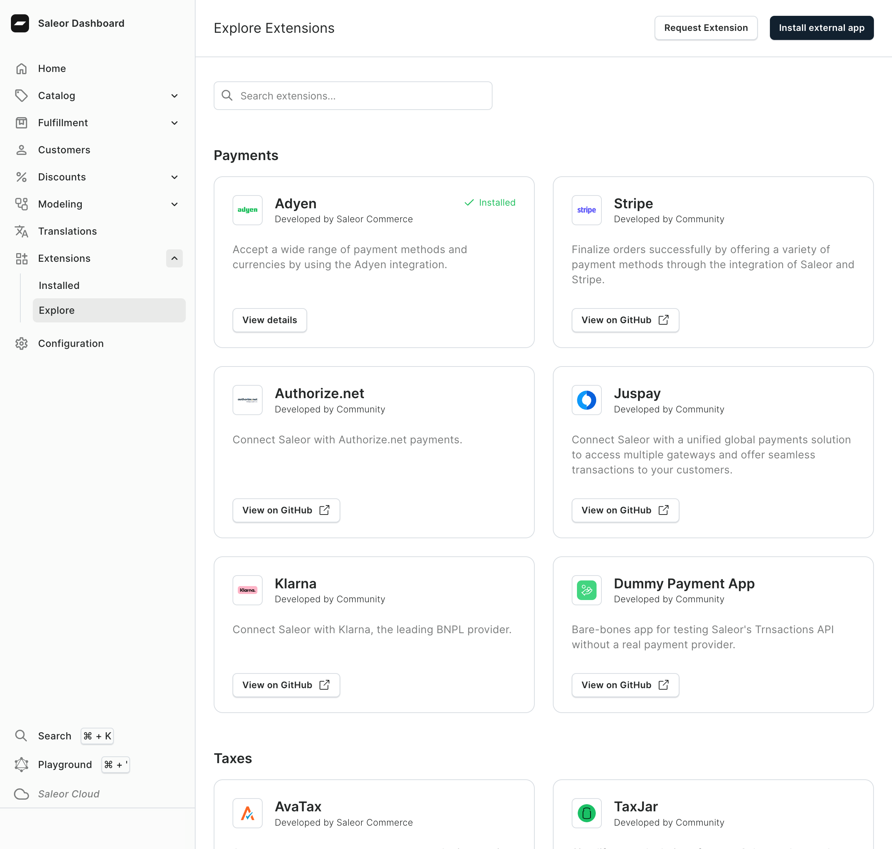

We are standardizing the extensibility model in Saleor by consolidating plugins, webhooks, and apps under a unified concept: extensions. For now, this change is reflected only in the user interface, providing a simplified and more cohesive way to manage extensions.

